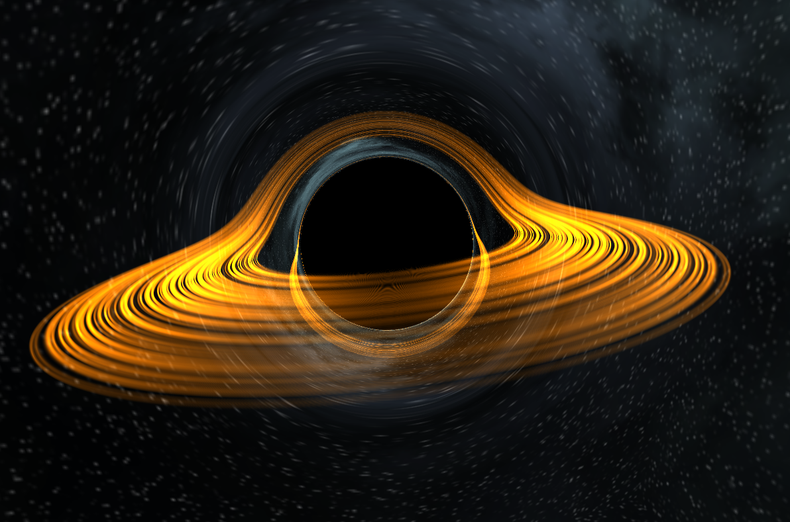

# Real-Time Black Hole Simulation

## Launch Requirements
* Platform: *Windows*
* PC **must** support *Vulkan*

## Build Requirements
* Platform: *Windows*
* *C++20*
* *Vulkan* SDK
* *GLFW*
* *GLM*

## Application Management
There are two application control points:

1. `constants.hpp`: Manage window size.
2. `my_vulkan/shaders/black_hole.comp`: Manage parameters of black hole simulation.

## How does it work
#### Physically Based Rendering
Using the explicit fourth-order Runge-Kutta method to solve the equation of the trajectory of light in the Schwarzschild metric and ray marching, a color sample from the surrounding black hole space is added to the final pixel color in the final image at each iteration.

